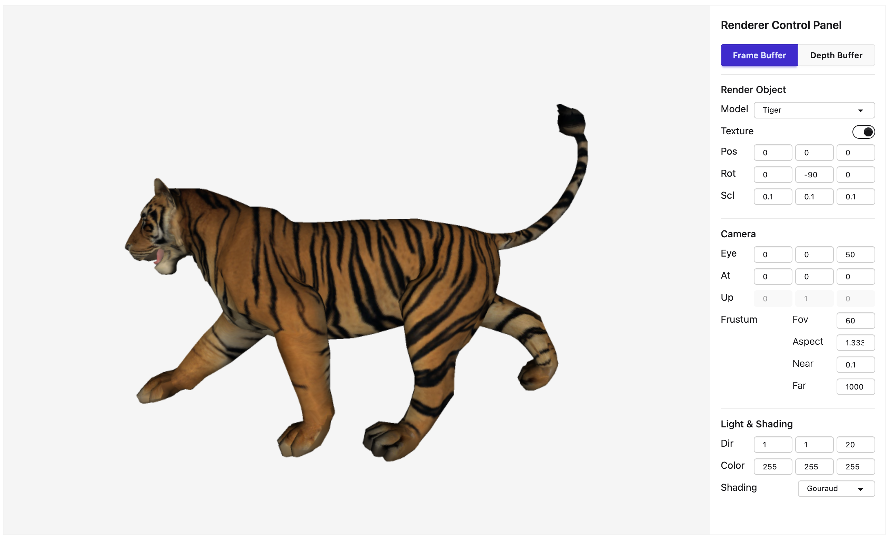

# Web Canvas Software Renderer

브라우저에서 동작하는 소프트웨어 렌더러(Software Renderer)입니다.

GPU(WebGL)를 사용하지 않고 렌더링 파이프라인(Rendering Pipeline)을 코드로 직접 구현하여 이미지 버퍼(배열)에 픽셀 데이터를 생성하고, 그 결과를 HTML Canvas에 렌더링합니다.

데모페이지: https://inium.github.io/web-canvas-software-renderer/dist/



## 구현 항목

3D 모델을 2D 이미지에 출력하는 과정인 Rendering Pipeline Process을 구현했으며 주요 구현 항목은 아래와 같습니다.

```Pipeline
Model → World → View → Backspace Culling → Shading → Clipping → Projection → Viewport → Rasterization
```

- Rasterization: Scanline Rendering & Anti-Aliasing (2x MSAA) - Frame Buffer, Depth Buffer 출력
- Backspace Culling
- Lighting: Ambient, Diffuse, Specular, Emission
- Shading: Flat, Smooth(Gouraud, Phong)
- Texture Mapping: Texture Load & Nearest Sampling
- Math: Matrix, Vector, Plane, 기타 Utility
- Mesh & Obj Loader

### 렌더링 모델 (.obj)

본 프로젝트는 다음 OBJ 모델을 사용합니다.

- Tiger, Bunny, Buddha, Zebra: [Texturemontage Textured Models](http://kunzhou.net/tex-models.htm)

- Teapot: [Utah University Graphics Lab](https://graphics.cs.utah.edu/teapot/)

## 구성

### 프로젝트 구조

본 프로젝트는 다음 기술 스택을 사용합니다.

- Vite + TypeScript
- 외부 라이브러리
- Alpine.js — 이벤트 핸들링
- DaisyUI — UI 구성

### 코드 규칙

다음 코드 규칙을 적용했습니다.

- husky + lint-staged
  - ESLint
  - Commitlint
  - Conventional Commit
- Prettier

### 개발

프로젝트를 Clone한 후 다음 명령어로 개발 환경을 실행할 수 있습니다.

```bash
npm run dev
```

코드 규칙이 정상적으로 동작하지 않을 경우 아래 명령어를 실행하세요.

```bash
npm run prepare
```

### 빌드

다음 명령어로 프로젝트를 빌드할 수 있습니다. 빌드 결과물은 /dist 폴더에서 확인할 수 있습니다.

```bash
npm run build
```

### LICENSE

MIT
